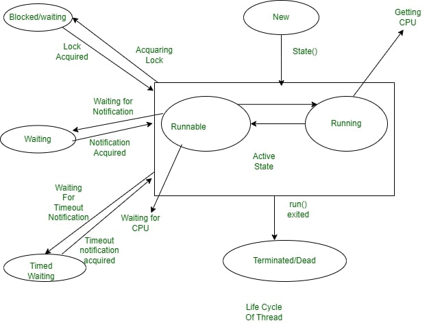

# Java

## Thread 
  >. Concept of Multitasking
     To help users Operating System accommodates users the privilege of multitasking, where users can perform multiple actions simultaneously on the machine. This Multitasking can be enabled in two ways:

  - Process-Based Multitasking
  - Thread-Based Multitasking 


   **Life Cycle of Thread**
  - New Thread
  - Runnable Thread  **start()**
  - Running Thread  **run()**
  - waiting Thread **sleep()**
  - Terminated (Dead Thread)


    
**How many way can create Thread**

  - By Extending Thread Class

```class MyThread extends Thread 
{
    // initiated run method for Thread
    public void run()
    {
          String str = "Thread Started Running...";
        System.out.println(str);
    }
```


  - By implementing Runnable 
```class MyThread implements Runnable 
{    
      // Method to start Thread
    public void run()
    {
          String str = "Thread is Running Successfully";
        System.out.println(str);
    }

}
```

**Thread Lifecycle Methods:**

  - start(): Starts the execution of the thread.
  - run(): Contains the code that defines the thread's behavior.
  - sleep(ms): Pauses the thread for the specified milliseconds.
  - yield(): Suggests the thread scheduler to give CPU time to other threads.
  - join(): Waits for a thread to finish before continuing execution.

**Thread Synchronization Methods:**

  - wait(): Makes the thread wait until another thread notifies it.
  - notify(): Wakes up a single thread waiting on the object's monitor.
  - notifyAll(): Wakes up all threads waiting on the object's monitor.

  - Thread Control Methods:
  - interrupt(): Interrupts a sleeping or waiting thread.
  - isInterrupted(): Checks if the thread has been interrupted.
  - setDaemon(true/false): Marks the thread as a daemon thread.
  - isAlive(): Checks if the thread is still running.

 **Thread Priority Methods:**
  - setPriority(int): Sets the priority of a thread (1 to 10).
  - getPriority(): Gets the priority of a thread.